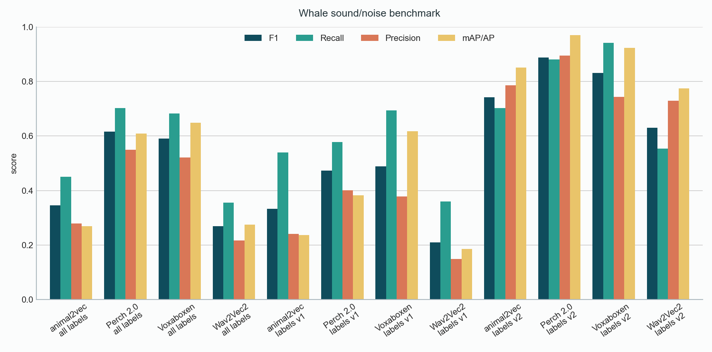
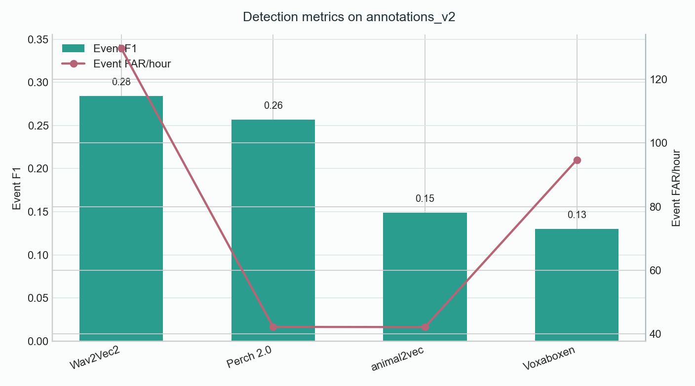
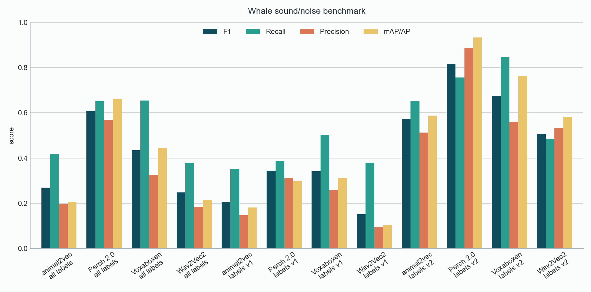
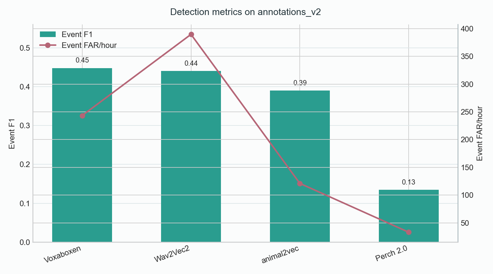

# Whale Sound/Noise Benchmark

Benchmark setup: pretrained encoders as feature extractors, plus one simple
`sound/noise` classifier trained on top of the embeddings. The encoder weights
were not updated.

## Data Setup

Data source:

https://drive.google.com/drive/folders/1bNVJlqsoper_BeKlSgoA1XtOU0GPj_TI?usp=drive_link

Annotation sets:

| Set | Meaning |
|---|---|
| `annotations_all` | annotation v1 and v2 merged |
| `annotations_v1` | first annotation export only |
| `annotations_v2` | second annotation export only |

Fixed file-level split for `annotations_v2`:

- Train IDs: `1, 10, 13, 15, 16, 17, 19, 20, 23, 25, 26, 33, 46, 57, 60`
- Test IDs: `9, 11, 12, 14, 18, 21, 22, 24, 28, 32`

The split is done by file/session, so windows from the same recording do not
appear in both train and test.

Corpus snapshot:

| Item | Value |
|---|---:|
| WAV files | 60 |
| Total duration | about 16.65 h |
| Channels | mono |
| Source sample rates | 40 kHz, 44.1 kHz, 60.6 kHz, 121.2 kHz, 192 kHz |

Window settings:

| Benchmark | Window | Hop | Label rule | Reason |
|---|---:|---:|---|---|
| 5-second benchmark | 5.0 s | 5.0 s | `sound` if overlap >= 0.1 s | coarse check on full clips |
| 1-second benchmark | 1.0 s | 1.0 s | `sound` if overlap >= 0.25 s | shorter whale events inside a clip |

## Models

| Model | Role | Input rate | Embedding dim | Encoder |
|---|---|---:|---:|---|
| Perch 2.0 | bioacoustic baseline | 32 kHz | 1536 | frozen |
| Voxaboxen BEATs | acoustic pipeline baseline | 16 kHz | 768 | frozen |
| animal2vec pretrained MeerKAT | bioacoustic candidate for fine-tuning | 8 kHz | 1024 | frozen |
| Wav2Vec2 base | general audio/speech baseline | 16 kHz | 768 | frozen |

animal2vec uses the official pretrained MeerKAT checkpoint:

```text
animal2vec_large_pretrained_MeerKAT_240507.pt
```

## Training Setup

Classifier settings:

| Setting | Value |
|---|---|
| Classifier | logistic head, `SGDClassifier(loss="log_loss")` |
| Encoder | frozen |
| Max epochs | 20 |
| Early stopping | validation average precision |
| Patience | 3 epochs |
| Saved outputs | epoch metrics, test metrics, predictions, plots |

Early stopping used validation AP with patience 3. Runs marked `20/20` reached
the full epoch limit.

## Training Epochs

### 5-Second Benchmark

| Model | Annotation set | Epochs completed | Best epoch | Max epochs |
|---|---|---:|---:|---:|
| animal2vec pretrained | all | 4 | 1 | 20 |
| animal2vec pretrained | v1 | 4 | 1 | 20 |
| animal2vec pretrained | v2 | 5 | 2 | 20 |
| Perch 2.0 | all | 4 | 1 | 20 |
| Perch 2.0 | v1 | 4 | 1 | 20 |
| Perch 2.0 | v2 | 4 | 1 | 20 |
| Voxaboxen BEATs | all | 7 | 4 | 20 |
| Voxaboxen BEATs | v1 | 4 | 1 | 20 |
| Voxaboxen BEATs | v2 | 4 | 1 | 20 |
| Wav2Vec2 base | all | 12 | 9 | 20 |
| Wav2Vec2 base | v1 | 13 | 10 | 20 |
| Wav2Vec2 base | v2 | 13 | 10 | 20 |

### 1-Second Benchmark

| Model | Annotation set | Epochs completed | Best epoch | Max epochs |
|---|---|---:|---:|---:|
| animal2vec pretrained | all | 6 | 3 | 20 |
| animal2vec pretrained | v1 | 11 | 8 | 20 |
| animal2vec pretrained | v2 | 4 | 1 | 20 |
| Perch 2.0 | all | 4 | 1 | 20 |
| Perch 2.0 | v1 | 20 | 20 | 20 |
| Perch 2.0 | v2 | 4 | 1 | 20 |
| Voxaboxen BEATs | all | 7 | 4 | 20 |
| Voxaboxen BEATs | v1 | 4 | 1 | 20 |
| Voxaboxen BEATs | v2 | 5 | 2 | 20 |
| Wav2Vec2 base | all | 20 | 20 | 20 |
| Wav2Vec2 base | v1 | 20 | 20 | 20 |
| Wav2Vec2 base | v2 | 10 | 7 | 20 |

## Metrics

Main window-level metrics:

| Metric | Meaning |
|---|---|
| mAP/AP | ranking quality for the `sound` class; higher is better |
| F1 | balance between precision and recall |
| Precision | how many predicted `sound` windows are correct |
| Recall | how many real `sound` windows are found |
| FPR | fraction of noise windows incorrectly predicted as `sound` |
| FNR | fraction of sound windows missed by the model |
| Recall @ P>=0.8 | recall when precision is at least 0.8 |

For this task, the most useful metrics are mAP/AP, F1, Recall, Precision, FPR,
and Recall @ P>=0.8. FNR is kept because it directly shows missed sound
windows.

## Detection Metrics

Detection metrics are counted after window predictions are converted back into
time intervals. Neighboring predicted `sound` windows are merged into one
predicted event, then predicted events are matched with annotation events by
temporal overlap.

| Metric | Meaning |
|---|---|
| Event precision | fraction of predicted sound events that overlap a real event |
| Event recall | fraction of real events found by predictions |
| Event F1 | balance between event precision and event recall |
| Event FAR/hour | false predicted sound events per hour |
| Recall @ FAR<=5/hour | event recall under a low false-alarm setting |
| Predicted sound min/hour | how many minutes per hour are marked as `sound` |

Event metrics are useful for checking temporal detections, but they depend on
the threshold and event merging rule. Window-level mAP/AP, F1, Recall,
Precision, and FPR are still the main comparison metrics at this frozen-encoder
stage.

## 5-Second Benchmark

Figure folder:

```text
reports/benchmark_figures/
```





Main table:

| Model | Annotation set | mAP/AP | F1 | Precision | Recall | FPR | FNR | Recall @ P>=0.8 |
|---|---|---:|---:|---:|---:|---:|---:|---:|
| Perch 2.0 | all | 0.6096 | 0.6163 | 0.5489 | 0.7025 | 0.2569 | 0.2975 | 0.0939 |
| Voxaboxen BEATs | all | 0.6483 | 0.5912 | 0.5216 | 0.6823 | 0.2779 | 0.3177 | 0.2710 |
| animal2vec pretrained | all | 0.2685 | 0.3450 | 0.2797 | 0.4503 | 0.5152 | 0.5497 | 0.0010 |
| Wav2Vec2 base | all | 0.2745 | 0.2697 | 0.2171 | 0.3558 | 0.5697 | 0.6442 | 0.0185 |
| Perch 2.0 | v1 | 0.3825 | 0.4729 | 0.4004 | 0.5774 | 0.2591 | 0.4226 | 0.0016 |
| Voxaboxen BEATs | v1 | 0.6180 | 0.4890 | 0.3776 | 0.6938 | 0.3416 | 0.3062 | 0.3413 |
| animal2vec pretrained | v1 | 0.2363 | 0.3327 | 0.2406 | 0.5391 | 0.5083 | 0.4609 | 0.0144 |
| Wav2Vec2 base | v1 | 0.1850 | 0.2102 | 0.1484 | 0.3604 | 0.6179 | 0.6396 | 0.0064 |
| Perch 2.0 | v2 | 0.9705 | 0.8878 | 0.8946 | 0.8810 | 0.2000 | 0.1190 | 0.9696 |
| Voxaboxen BEATs | v2 | 0.9236 | 0.8309 | 0.7431 | 0.9424 | 0.6161 | 0.0576 | 0.8647 |
| animal2vec pretrained | v2 | 0.8510 | 0.7417 | 0.7865 | 0.7018 | 0.3602 | 0.2982 | 0.6667 |
| Wav2Vec2 base | v2 | 0.7740 | 0.6296 | 0.7294 | 0.5539 | 0.3886 | 0.4461 | 0.3810 |

Detection metrics on `annotations_v2`:

| Model | Event F1 | Event precision | Event recall | Event FAR/hour | Recall @ FAR<=5/hour | Predicted sound min/hour |
|---|---:|---:|---:|---:|---:|---:|
| Perch 2.0 | 0.2570 | 0.8209 | 0.1524 | 42.15 | 0.2050 | 38.90 |
| Wav2Vec2 base | 0.2845 | 0.6408 | 0.1828 | 129.76 | 0.0609 | 30.27 |
| animal2vec pretrained | 0.1489 | 0.7143 | 0.0831 | 42.08 | 0.0886 | 35.57 |
| Voxaboxen BEATs | 0.1301 | 0.5000 | 0.0748 | 94.69 | 0.1801 | 50.27 |

## 1-Second Benchmark

Figure folder:

```text
reports/benchmark_1s_figures/
```





Main table:

| Model | Annotation set | mAP/AP | F1 | Precision | Recall | FPR | FNR | Recall @ P>=0.8 |
|---|---|---:|---:|---:|---:|---:|---:|---:|
| Perch 2.0 | all | 0.6595 | 0.6072 | 0.5687 | 0.6512 | 0.2092 | 0.3488 | 0.2650 |
| Voxaboxen BEATs | all | 0.4433 | 0.4345 | 0.3253 | 0.6541 | 0.2890 | 0.3459 | 0.0469 |
| Wav2Vec2 base | all | 0.2143 | 0.2483 | 0.1845 | 0.3795 | 0.3572 | 0.6205 | 0.0017 |
| animal2vec pretrained | all | 0.2049 | 0.2685 | 0.1974 | 0.4199 | 0.3638 | 0.5801 | 0.0034 |
| Voxaboxen BEATs | v1 | 0.3109 | 0.3418 | 0.2591 | 0.5022 | 0.1906 | 0.4978 | 0.0458 |
| Perch 2.0 | v1 | 0.2980 | 0.3448 | 0.3105 | 0.3876 | 0.2410 | 0.6124 | 0.0030 |
| animal2vec pretrained | v1 | 0.1816 | 0.2071 | 0.1467 | 0.3524 | 0.2720 | 0.6476 | 0.0100 |
| Wav2Vec2 base | v1 | 0.1041 | 0.1520 | 0.0950 | 0.3793 | 0.4794 | 0.6207 | 0.0000 |
| Perch 2.0 | v2 | 0.9338 | 0.8162 | 0.8857 | 0.7569 | 0.1857 | 0.2431 | 0.9176 |
| Voxaboxen BEATs | v2 | 0.7631 | 0.6747 | 0.5607 | 0.8468 | 0.5217 | 0.1532 | 0.4325 |
| animal2vec pretrained | v2 | 0.5881 | 0.5742 | 0.5124 | 0.6528 | 0.4884 | 0.3472 | 0.1253 |
| Wav2Vec2 base | v2 | 0.5827 | 0.5077 | 0.5323 | 0.4853 | 0.3353 | 0.5147 | 0.1125 |

Detection metrics on `annotations_v2`:

| Model | Event F1 | Event precision | Event recall | Event FAR/hour | Recall @ FAR<=5/hour | Predicted sound min/hour |
|---|---:|---:|---:|---:|---:|---:|
| Voxaboxen BEATs | 0.4484 | 0.4454 | 0.4515 | 243.37 | 0.0000 | 39.91 |
| Wav2Vec2 base | 0.4409 | 0.3738 | 0.5374 | 389.63 | 0.0831 | 24.06 |
| animal2vec pretrained | 0.3902 | 0.5258 | 0.3102 | 121.08 | 0.0914 | 33.73 |
| Perch 2.0 | 0.1343 | 0.5000 | 0.0776 | 33.16 | 0.2632 | 44.70 |

## Commands

5-second summary and figures:

```powershell
python filtering/benchmark/summarize_results.py --root outputs\benchmark --output-dir outputs\benchmark\report
python filtering\benchmark\collect_figures.py --output-dir reports\benchmark_figures
```

1-second windows and figures:

```powershell
python filtering/benchmark/prepare_windows_from_manifests.py `
  --source-root outputs\benchmark `
  --audio-dir <audio_dir> `
  --output-root outputs\benchmark_1s `
  --window-size-s 1.0 `
  --hop-size-s 1.0 `
  --min-sound-overlap-s 0.25

python filtering/benchmark/summarize_results.py `
  --root outputs\benchmark_1s\runs `
  --output-dir outputs\benchmark_1s\report

python filtering\benchmark\collect_figures.py `
  --runs-dir outputs\benchmark_1s\runs `
  --report-dir outputs\benchmark_1s\report `
  --output-dir reports\benchmark_1s_figures
```
