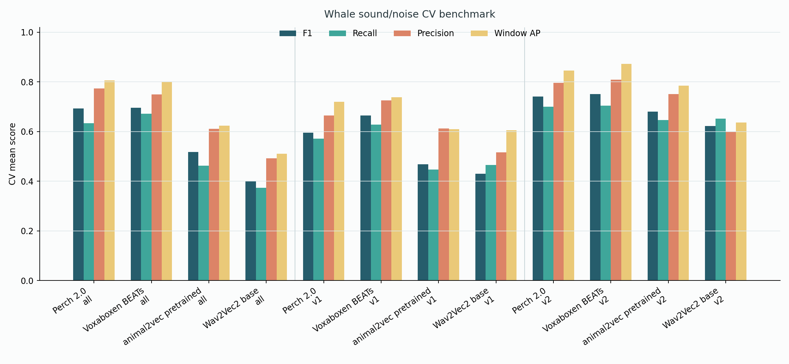
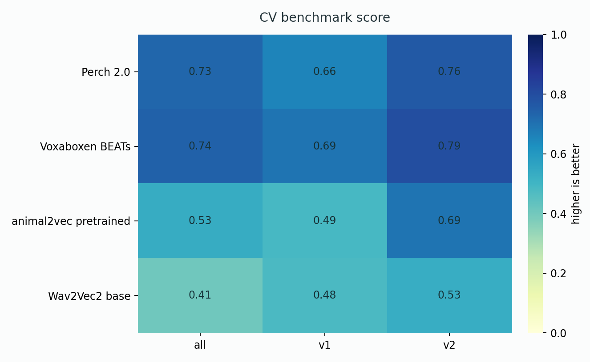
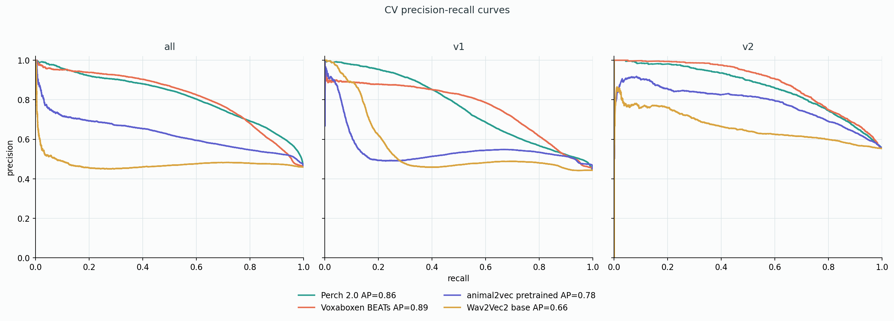
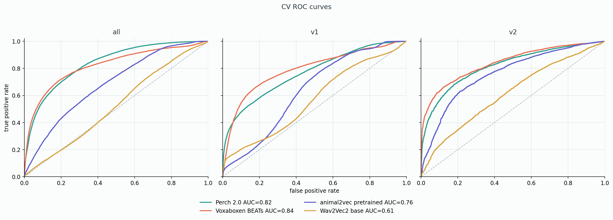

# Whale Sound/Noise Benchmark

Pretrained encoders are used as frozen feature extractors. For each model,
embeddings are extracted from the same audio windows, then a small logistic
`sound/noise` head is trained on top.

## Data

Source:

https://drive.google.com/drive/folders/1bNVJlqsoper_BeKlSgoA1XtOU0GPj_TI?usp=drive_link

Binary labels:

| Label | Meaning |
|---|---|
| `sound` | target whale sounds |
| `noise` | background, silence, artifacts, non-target audio, and unmarked audio |

All target sound classes are merged into `sound`. Overlapping sound intervals
are merged before window labeling.

Annotation sets:

| Set | Meaning |
|---|---|
| `annotations_all` | annotation v1 and v2 merged |
| `annotations_v1` | first annotation export only |
| `annotations_v2` | second annotation export only |

## Windowing

| Field | Value |
|---|---:|
| Audio context | 5.0 s |
| Hop | 1.0 s |
| Label rule | `sound` if overlap with merged sound annotation is at least 0.25 s |

The 5-second context matches Perch's native receptive field. The 1-second hop
keeps the output timeline detailed enough for review plots and event merging.

## Models

| Model | Input rate | Embedding dim | Notes |
|---|---:|---:|---|
| Perch 2.0 | 32 kHz | 1536 | bioacoustic baseline |
| Voxaboxen BEATs | 16 kHz | 768 | acoustic baseline |
| animal2vec pretrained MeerKAT | 8 kHz | 1024 | bioacoustic model |
| Wav2Vec2 base | 16 kHz | 768 | general audio/speech baseline |

## Cross-Validation

The main benchmark uses 5-fold file-level cross-validation for each annotation
set.

The folds are stratified by the fraction of `sound` windows in each file. Each
fold uses separate train, validation, and test files. Validation is used for
early stopping and threshold selection.

| Annotation set | Files per fold |
|---|---|
| `annotations_all` | 33 train, 11 validation, 11 test |
| `annotations_v1` | 18 train, 6 validation, 6 test |
| `annotations_v2` | 15 train, 5 validation, 5 test |

## Training

| Setting | Value |
|---|---|
| Classifier | logistic head, `SGDClassifier(loss="log_loss")` |
| Encoder | frozen |
| Max epochs | 20 |
| Early stopping | validation average precision |
| Patience | 4 epochs |
| Output | epoch metrics, test predictions, metrics JSON, plots |

## Metrics

Window metrics:

| Metric | Meaning |
|---|---|
| Window AP | average precision for `sound`; main ranking metric |
| F1 | balance between precision and recall |
| Precision | how many predicted `sound` windows are correct |
| Recall | how many real `sound` windows are found |
| FPR | fraction of noise windows predicted as `sound` |
| FNR | fraction of sound windows missed |
| Recall @ P>=0.8 | recall while keeping precision at least 0.8 |

Detection metrics:

| Metric | Meaning |
|---|---|
| Event F1 | F1 after neighboring positive windows are merged into events |
| Event FAR/hour | false sound events per hour |
| Event AP@0.5 / AP@0.8 | threshold sweep with temporal IoU matching |

Window AP, F1, Precision, Recall, FPR, and Recall @ P>=0.8 are the main
metrics for model choice. Event metrics are kept for long-recording detection
behavior, but they are sensitive to threshold and event merging.

## Results

Figure folder:

```text
reports/benchmark_context5_hop1_cv/
```





The heatmap score is a compact comparison:

```text
0.35 * Window AP + 0.30 * F1 + 0.20 * Recall @ P>=0.8 + 0.15 * (1 - FPR)
```

It is not a replacement for the table. It is used only to make the main pattern
easier to see.





Main CV table, mean +/- std across 5 folds:

| Model | Annotation set | Window AP | F1 | Precision | Recall | FPR | Recall @ P>=0.8 | Event AP@0.5 |
|---|---|---:|---:|---:|---:|---:|---:|---:|
| Perch 2.0 | all | 0.806 +/- 0.093 | 0.693 +/- 0.105 | 0.773 +/- 0.086 | 0.633 +/- 0.127 | 0.143 +/- 0.018 | 0.556 +/- 0.296 | 0.005 +/- 0.003 |
| Voxaboxen BEATs | all | 0.801 +/- 0.124 | 0.696 +/- 0.139 | 0.750 +/- 0.125 | 0.672 +/- 0.175 | 0.172 +/- 0.072 | 0.629 +/- 0.266 | 0.003 +/- 0.001 |
| animal2vec pretrained | all | 0.623 +/- 0.166 | 0.518 +/- 0.180 | 0.611 +/- 0.184 | 0.462 +/- 0.192 | 0.218 +/- 0.061 | 0.209 +/- 0.372 | 0.004 +/- 0.002 |
| Wav2Vec2 base | all | 0.511 +/- 0.082 | 0.400 +/- 0.082 | 0.492 +/- 0.081 | 0.373 +/- 0.154 | 0.318 +/- 0.142 | 0.021 +/- 0.036 | 0.003 +/- 0.002 |
| Perch 2.0 | v1 | 0.719 +/- 0.290 | 0.595 +/- 0.273 | 0.665 +/- 0.296 | 0.571 +/- 0.293 | 0.212 +/- 0.149 | 0.538 +/- 0.345 | 0.004 +/- 0.004 |
| Voxaboxen BEATs | v1 | 0.738 +/- 0.253 | 0.665 +/- 0.193 | 0.726 +/- 0.246 | 0.628 +/- 0.177 | 0.174 +/- 0.113 | 0.549 +/- 0.390 | 0.003 +/- 0.001 |
| animal2vec pretrained | v1 | 0.609 +/- 0.249 | 0.469 +/- 0.204 | 0.613 +/- 0.245 | 0.448 +/- 0.209 | 0.280 +/- 0.279 | 0.119 +/- 0.259 | 0.004 +/- 0.004 |
| Wav2Vec2 base | v1 | 0.605 +/- 0.138 | 0.430 +/- 0.204 | 0.516 +/- 0.231 | 0.466 +/- 0.284 | 0.350 +/- 0.287 | 0.192 +/- 0.268 | 0.003 +/- 0.002 |
| Perch 2.0 | v2 | 0.846 +/- 0.075 | 0.741 +/- 0.092 | 0.796 +/- 0.080 | 0.700 +/- 0.123 | 0.224 +/- 0.083 | 0.646 +/- 0.245 | 0.018 +/- 0.009 |
| Voxaboxen BEATs | v2 | 0.873 +/- 0.065 | 0.751 +/- 0.097 | 0.808 +/- 0.073 | 0.705 +/- 0.127 | 0.200 +/- 0.041 | 0.714 +/- 0.168 | 0.013 +/- 0.007 |
| animal2vec pretrained | v2 | 0.785 +/- 0.092 | 0.680 +/- 0.153 | 0.751 +/- 0.079 | 0.646 +/- 0.225 | 0.290 +/- 0.201 | 0.546 +/- 0.317 | 0.008 +/- 0.005 |
| Wav2Vec2 base | v2 | 0.637 +/- 0.170 | 0.622 +/- 0.166 | 0.598 +/- 0.152 | 0.652 +/- 0.190 | 0.533 +/- 0.194 | 0.257 +/- 0.357 | 0.011 +/- 0.003 |

Training epochs, mean across folds:

| Model | Annotation set | Epochs completed | Best epoch | Folds |
|---|---|---:|---:|---:|
| Perch 2.0 | all | 11.2 | 8.0 | 5 |
| Voxaboxen BEATs | all | 5.0 | 1.0 | 5 |
| animal2vec pretrained | all | 11.2 | 8.0 | 5 |
| Wav2Vec2 base | all | 12.6 | 10.2 | 5 |
| Perch 2.0 | v1 | 7.2 | 3.2 | 5 |
| Voxaboxen BEATs | v1 | 6.8 | 2.8 | 5 |
| animal2vec pretrained | v1 | 8.0 | 4.0 | 5 |
| Wav2Vec2 base | v1 | 14.6 | 13.0 | 5 |
| Perch 2.0 | v2 | 8.8 | 5.6 | 5 |
| Voxaboxen BEATs | v2 | 8.8 | 5.6 | 5 |
| animal2vec pretrained | v2 | 7.2 | 3.2 | 5 |
| Wav2Vec2 base | v2 | 12.8 | 9.6 | 5 |

`Epochs completed` and `Best epoch` are averaged over 5 folds. For example,
`11.2` means that the five CV heads stopped after different epoch counts, and
their mean was 11.2 epochs. Early stopping used validation Window AP.

## Notes

Across CV folds, Voxaboxen BEATs has the highest `annotations_v2` Window AP and
F1. Perch 2.0 is very close on `annotations_all` and has the lowest FPR there.
animal2vec pretrained is weaker as a frozen encoder, but it remains useful for
the later fine-tuning stage. Wav2Vec2 base is weaker than the specialized
bioacoustic encoders and stays as a general baseline.

## Commands

Create CV splits:

```powershell
python filtering\benchmark\make_file_cv_splits.py `
  --windows outputs\benchmark_context5_hop1\annotations_v2\windows.csv `
  --base-splits outputs\benchmark_context5_hop1\annotations_v2\splits.csv `
  --output-dir outputs\benchmark_context5_hop1_cv\annotations_v2 `
  --folds 5 `
  --seed 42
```

Train one CV fold:

```powershell
python filtering\benchmark\train_downstream.py `
  --model-name perch_v2 `
  --scenario annotations_v2 `
  --embeddings outputs\benchmark_context5_hop1\embeddings\perch_v2_all_audio\embeddings.npy `
  --embedding-manifest outputs\benchmark_context5_hop1\embeddings\perch_v2_all_audio\manifest.csv `
  --annotations outputs\benchmark_context5_hop1\annotations_v2\annotations_manifest.csv `
  --splits outputs\benchmark_context5_hop1_cv\annotations_v2\fold_01\splits.csv `
  --output-dir outputs\benchmark_context5_hop1_cv\runs\perch_v2\annotations_v2\fold_01 `
  --min-sound-overlap-s 0.25 `
  --min-window-duration-s 0.5 `
  --epochs 20 `
  --patience 4 `
  --decision-threshold 0.5 `
  --event-iou-threshold 0.1 `
  --event-merge-gap-s 1.0
```

Summarize CV:

```powershell
python filtering\benchmark\summarize_cv_benchmark.py `
  --runs-dir outputs\benchmark_context5_hop1_cv\runs `
  --output-dir reports\benchmark_context5_hop1_cv

python filtering\benchmark\summarize_cv_thresholds.py `
  --thresholds-dir outputs\benchmark_context5_hop1_cv\thresholds `
  --output-dir reports\benchmark_context5_hop1_cv
```
