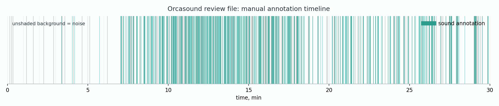
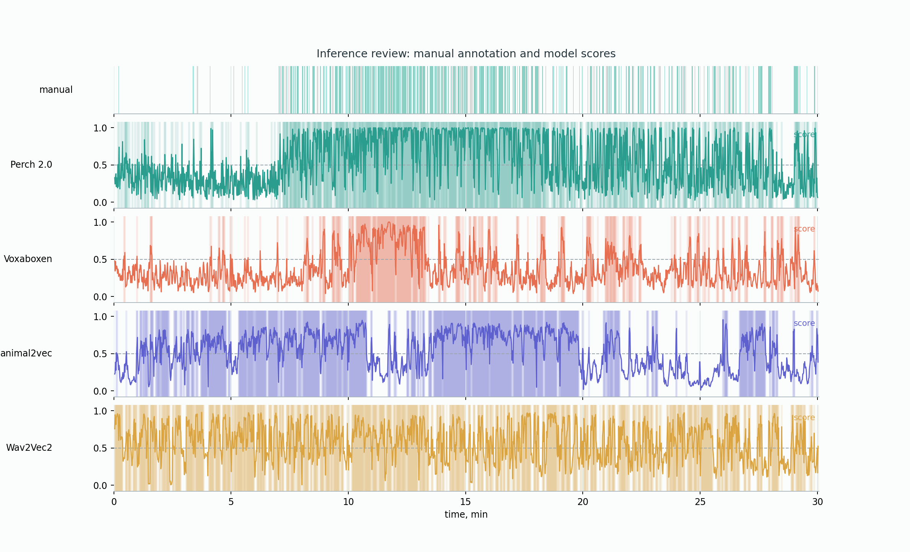
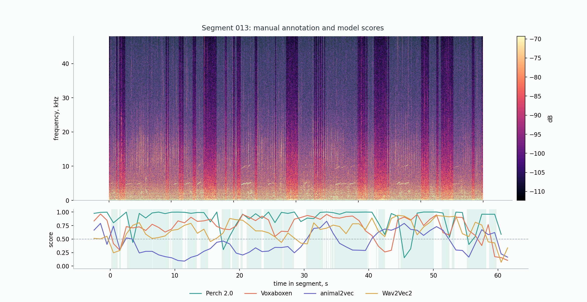
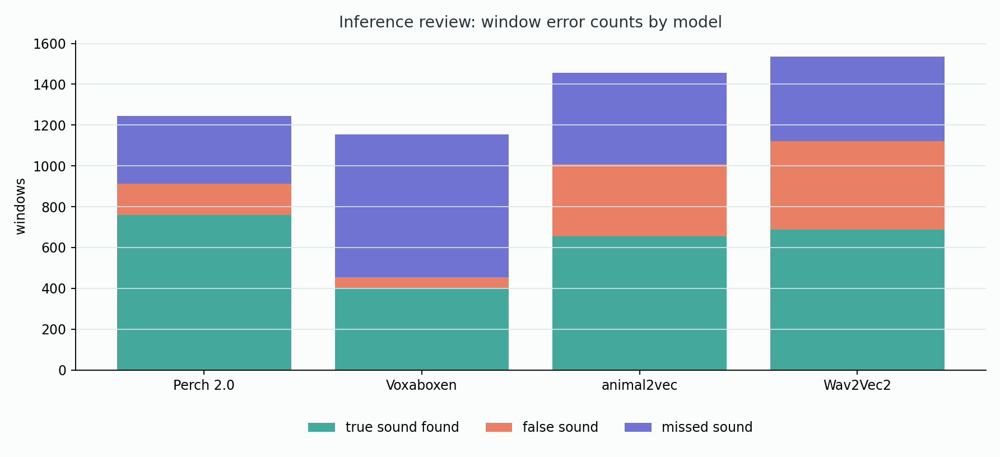
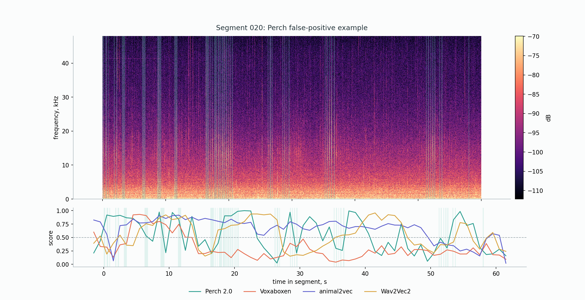
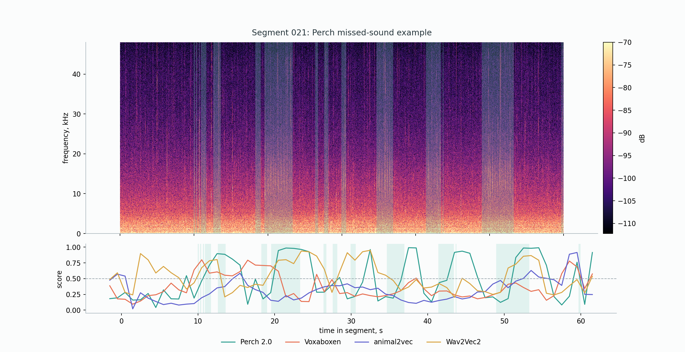

# Inference Review

Review data:

https://drive.google.com/drive/folders/17tXxcmV6TCNgcI86LCKV-pZRgMXrOdFS?usp=sharing

The review set is a 30-minute Orcasound fragment stored as ordered one-minute
WAV files. The files are treated as one continuous recording for plots and
metrics.

## Current Setup

| Field | Value |
|---|---:|
| Encoder context | 5.0 s |
| Hop | 1.0 s |
| Current head | `annotations_all` CV ensemble, 5 heads averaged |
| Temporary score cutoff | 0.5 |
| Event merge gap | 1.0 s |

The current review uses `annotations_all` CV heads, the cutoff `0.5` is only
used to draw temporary binary `sound/noise` intervals. The final threshold
is selected after fine-tuning.

## Results

Output folder:

```text
reports/inference_review_context5_hop1/orcasound_2020-06-26-SRKW-Lpod_cv_annotations_all/
```

| Model | Precision | Recall | F1 | AP | ROC-AUC | Predicted sound windows | Predicted events |
|---|---:|---:|---:|---:|---:|---:|---:|
| Perch 2.0 | 0.830 | 0.695 | 0.757 | 0.861 | 0.785 | 913 | 42 |
| Voxaboxen | 0.883 | 0.364 | 0.515 | 0.806 | 0.684 | 454 | 53 |
| animal2vec | 0.648 | 0.593 | 0.620 | 0.723 | 0.590 | 1009 | 29 |
| Wav2Vec2 | 0.613 | 0.623 | 0.618 | 0.587 | 0.486 | 1121 | 43 |

At the temporary `0.5` cutoff, Perch gives the best practical balance on this
review file. Voxaboxen is cleaner but misses more marked sound windows.
animal2vec and Wav2Vec2 mark more audio as `sound`, but their score ranking is
weaker than Perch.

## Figures

Manual annotation timeline:



`annotations_all` CV ensemble scores:



Segment 013 with `annotations_all` CV ensemble scores:



Window errors with `annotations_all` CV ensemble:



Perch false-positive example:



Perch missed-sound example:



## Commands

Manual annotation spectrograms:

```powershell
python filtering\review\plot_inference_review.py
```

Prepare review windows:

```powershell
python filtering\review\prepare_inference_windows.py `
  --output-dir outputs\inference_review_context5_hop1\orcasound_2020-06-26-SRKW-Lpod `
  --window-size-s 5.0 `
  --hop-size-s 1.0 `
  --min-window-s 0.5 `
  --min-sound-overlap-s 0.25
```

Apply one CV ensemble:

```powershell
python filtering\review\apply_cv_ensemble.py `
  --model-name perch_v2 `
  --embeddings outputs\inference_review_context5_hop1\orcasound_2020-06-26-SRKW-Lpod\embeddings\perch_v2\embeddings.npy `
  --manifest outputs\inference_review_context5_hop1\orcasound_2020-06-26-SRKW-Lpod\embeddings\perch_v2\manifest.csv `
  --windows outputs\inference_review_context5_hop1\orcasound_2020-06-26-SRKW-Lpod\windows.csv `
  --heads-dir outputs\benchmark_context5_hop1_cv\runs\perch_v2\annotations_all `
  --output-dir outputs\inference_review_context5_hop1\orcasound_2020-06-26-SRKW-Lpod\predictions_cv_annotations_all\perch_v2 `
  --threshold 0.5 `
  --merge-gap-s 1.0 `
  --events data\long_file_A\orcasound_2020-06-26-SRKW-Lpod\annotations\annotation3_long_A_sound_events_merged.csv `
  --min-sound-overlap-s 0.25
```

Summary and overlays:

```powershell
python filtering\review\summarize_inference_review.py `
  --predictions-dir outputs\inference_review_context5_hop1\orcasound_2020-06-26-SRKW-Lpod\predictions_cv_annotations_all `
  --output-dir reports\inference_review_context5_hop1\orcasound_2020-06-26-SRKW-Lpod_cv_annotations_all `
  --segment 13 `
  --segments 1,3,5,8,13,18,23,28
```
