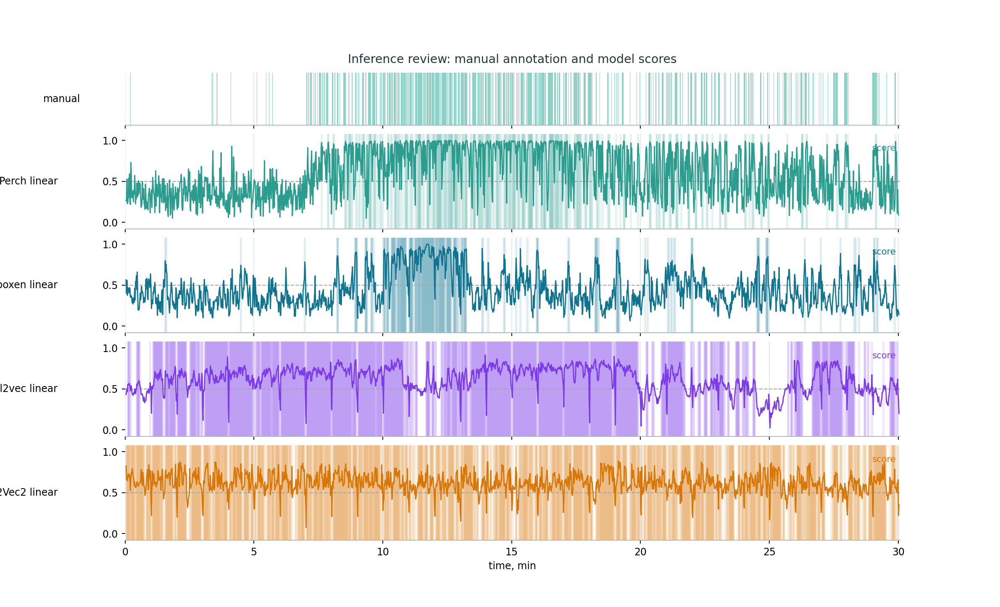
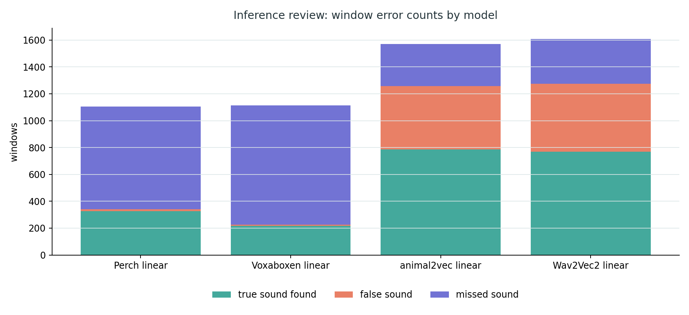
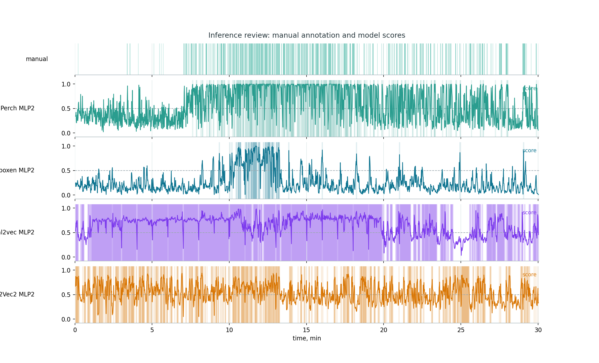
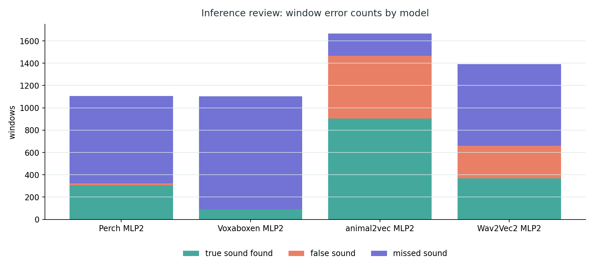
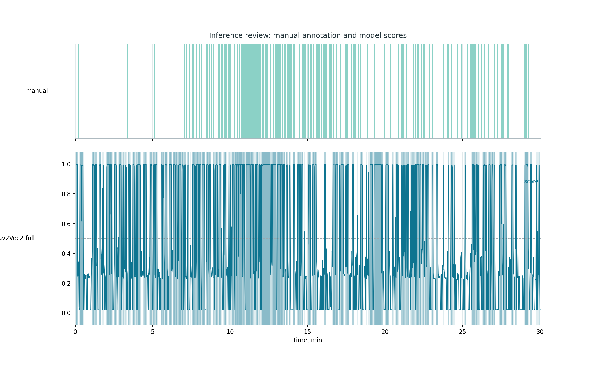
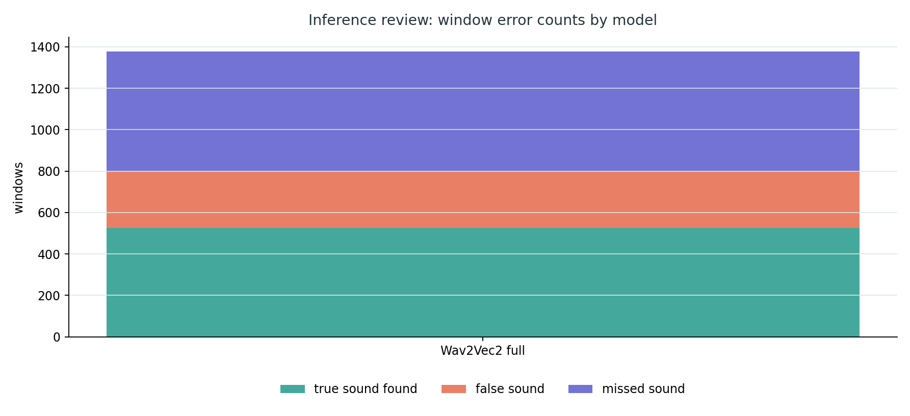
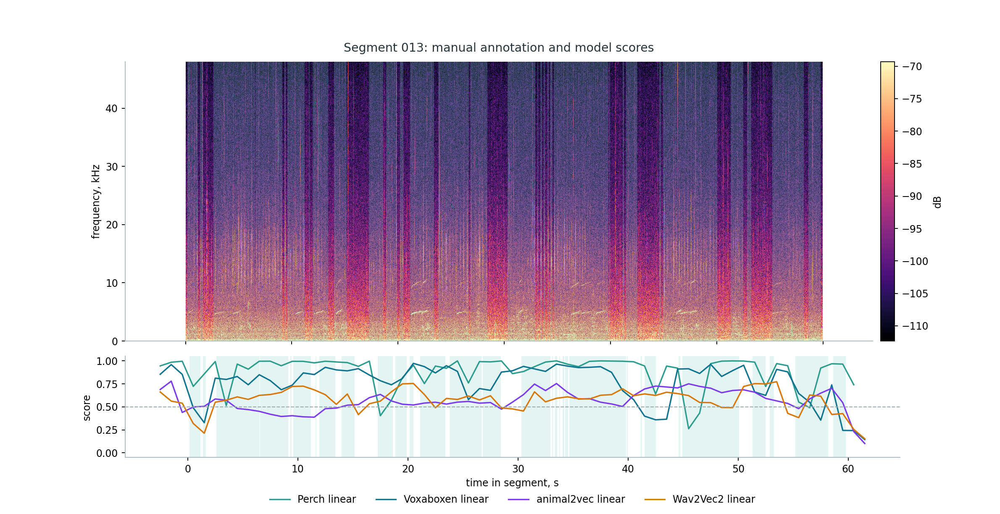
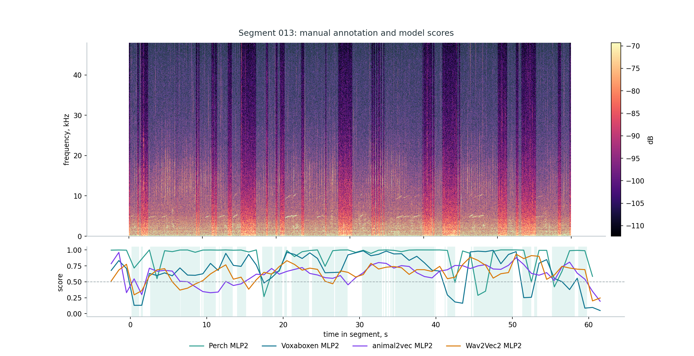
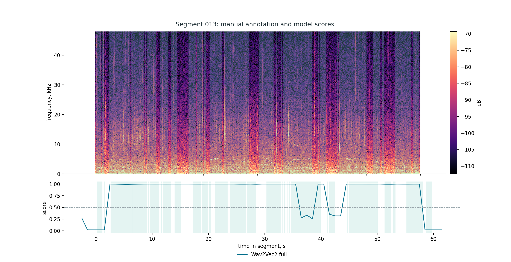

# Inference Review

Review data:

https://drive.google.com/drive/folders/17tXxcmV6TCNgcI86LCKV-pZRgMXrOdFS?usp=sharing

The review set is a 30-minute Orcasound fragment stored as ordered one-minute
WAV files. The files are treated as one continuous recording for plots and
metrics.

## Setup

| Field | Value |
|---|---:|
| Encoder context | 5.0 s |
| Hop | 1.0 s |
| Current head | `annotations_all` CV ensemble, 5 heads averaged |
| Temporary score cutoff | 0.5 |
| Event merge gap | 1.0 s |

The current review uses `annotations_all` CV heads, the cutoff `0.5` is only
used to draw temporary binary `sound/noise` intervals. The final threshold
is selected after fine-tuning.

## Results

Output folder:

```text
reports/inference_review_context5_hop1/orcasound_2020-06-26-SRKW-Lpod_cv_annotations_all/
```

| Model | Precision | Recall | F1 | AP | ROC-AUC | Predicted sound windows | Predicted events |
|---|---:|---:|---:|---:|---:|---:|---:|
| Perch 2.0 | 0.830 | 0.695 | 0.757 | 0.861 | 0.785 | 913 | 42 |
| Voxaboxen | 0.883 | 0.364 | 0.515 | 0.806 | 0.684 | 454 | 53 |
| animal2vec | 0.648 | 0.593 | 0.620 | 0.723 | 0.590 | 1009 | 29 |
| Wav2Vec2 | 0.613 | 0.623 | 0.618 | 0.587 | 0.486 | 1121 | 43 |

At the temporary `0.5` cutoff, Perch gives the best practical balance on this
review file. Voxaboxen is cleaner but misses more marked sound windows.
animal2vec and Wav2Vec2 mark more audio as `sound`, but their score ranking is
weaker than Perch.

## Figures

Manual annotation timeline:


`annotations_all` CV ensemble scores:


Segment 013 with `annotations_all` CV ensemble scores:


Window errors with `annotations_all` CV ensemble:


Perch false-positive example:


Perch missed-sound example:


## Tuning Inference Review

The tuning models were also projected onto the same 30-minute Orcasound review file. This uses the same 5 s / 1 s windows and the same manual annotations as above, but applies the HPC tuning checkpoints instead of the baseline CV benchmark heads.

Output folders:

```text
reports/inference_review_context5_hop1/orcasound_2020-06-26-SRKW-Lpod_tuning_heads_linear/
reports/inference_review_context5_hop1/orcasound_2020-06-26-SRKW-Lpod_tuning_heads_mlp2/
reports/inference_review_context5_hop1/orcasound_2020-06-26-SRKW-Lpod_tuning_full/
```

| Model | Precision | Recall | F1 | AP | ROC-AUC | Predicted sound windows | Predicted events |
|---|---:|---:|---:|---:|---:|---:|---:|
| Perch linear | 0.956 | 0.298 | 0.455 | 0.871 | 0.795 | 340 | 61 |
| Perch MLP2 | 0.947 | 0.281 | 0.433 | 0.862 | 0.787 | 323 | 59 |
| Voxaboxen linear | 0.952 | 0.196 | 0.325 | 0.798 | 0.677 | 227 | 35 |
| Voxaboxen MLP2 | 1.000 | 0.083 | 0.153 | 0.794 | 0.665 | 91 | 17 |
| animal2vec linear | 0.627 | 0.714 | 0.668 | 0.699 | 0.579 | 1256 | 30 |
| animal2vec MLP2 | 0.616 | 0.819 | 0.703 | 0.720 | 0.573 | 1467 | 20 |
| Wav2Vec2 linear | 0.603 | 0.698 | 0.647 | 0.573 | 0.456 | 1275 | 29 |
| Wav2Vec2 MLP2 | 0.558 | 0.334 | 0.418 | 0.573 | 0.458 | 659 | 86 |
| Wav2Vec2 full | 0.655 | 0.476 | 0.552 | 0.692 | 0.563 | 801 | 75 |

The 2-head models reproduce the same pattern as the HPC tuning table: Perch and Voxaboxen heads are conservative and high-precision, while animal2vec and Wav2Vec2 heads mark much more audio as `sound`. This is useful for visual diagnosis, but it does not contradict the event-level tuning result: high window recall here can still produce poor event overlap after thresholding.

Linear 2-head score timeline:



Linear 2-head window errors:



MLP2 2-head score timeline:



MLP2 2-head window errors:



Full fine-tune score timeline:



Full fine-tune window errors:



Example segment overlays:







All selected one-minute tuning overlays are saved under:

```text
reports/inference_review_context5_hop1/orcasound_2020-06-26-SRKW-Lpod_tuning_heads_linear/segment_001_inference_overlay.png
...
reports/inference_review_context5_hop1/orcasound_2020-06-26-SRKW-Lpod_tuning_full/segment_028_inference_overlay.png
```

## Commands

Manual annotation spectrograms:

```powershell
python filtering\review\plot_inference_review.py
```

Prepare review windows:

```powershell
python filtering\review\prepare_inference_windows.py `
  --output-dir outputs\inference_review_context5_hop1\orcasound_2020-06-26-SRKW-Lpod `
  --window-size-s 5.0 `
  --hop-size-s 1.0 `
  --min-window-s 0.5 `
  --min-sound-overlap-s 0.25
```

Apply one CV ensemble:

```powershell
python filtering\review\apply_cv_ensemble.py `
  --model-name perch_v2 `
  --embeddings outputs\inference_review_context5_hop1\orcasound_2020-06-26-SRKW-Lpod\embeddings\perch_v2\embeddings.npy `
  --manifest outputs\inference_review_context5_hop1\orcasound_2020-06-26-SRKW-Lpod\embeddings\perch_v2\manifest.csv `
  --windows outputs\inference_review_context5_hop1\orcasound_2020-06-26-SRKW-Lpod\windows.csv `
  --heads-dir outputs\benchmark_context5_hop1_cv\runs\perch_v2\annotations_all `
  --output-dir outputs\inference_review_context5_hop1\orcasound_2020-06-26-SRKW-Lpod\predictions_cv_annotations_all\perch_v2 `
  --threshold 0.5 `
  --merge-gap-s 1.0 `
  --events data\long_file_A\orcasound_2020-06-26-SRKW-Lpod\annotations\annotation3_long_A_sound_events_merged.csv `
  --min-sound-overlap-s 0.25
```

Summary and overlays:

```powershell
python filtering\review\summarize_inference_review.py `
  --predictions-dir outputs\inference_review_context5_hop1\orcasound_2020-06-26-SRKW-Lpod\predictions_cv_annotations_all `
  --output-dir reports\inference_review_context5_hop1\orcasound_2020-06-26-SRKW-Lpod_cv_annotations_all `
  --segment 13 `
  --segments 1,3,5,8,13,18,23,28
```

Apply one HPC 2-head CV ensemble:

```powershell
python -m filtering.review.apply_embedding_head_cv `
  --model-name perch_v2_mlp2 `
  --embeddings outputs\inference_review_context5_hop1\orcasound_2020-06-26-SRKW-Lpod\embeddings\perch_v2\embeddings.npy `
  --manifest outputs\inference_review_context5_hop1\orcasound_2020-06-26-SRKW-Lpod\embeddings\perch_v2\manifest.csv `
  --windows outputs\inference_review_context5_hop1\orcasound_2020-06-26-SRKW-Lpod\windows.csv `
  --heads-dir runs\embedding_heads_cv\perch_v2_mlp2\annotations_all `
  --output-dir outputs\inference_review_context5_hop1\orcasound_2020-06-26-SRKW-Lpod\predictions_tuning\perch_v2_mlp2 `
  --events data\long_file_A\orcasound_2020-06-26-SRKW-Lpod\annotations\annotation3_long_A_sound_events_merged.csv
```

Apply full Wav2Vec2 detector:

```powershell
python -m filtering.review.apply_wav2vec2_detector `
  --checkpoint runs\wav2vec2_detector\fold_01\best_checkpoint.pt `
  --windows outputs\inference_review_context5_hop1\orcasound_2020-06-26-SRKW-Lpod\windows.csv `
  --audio-dir data\long_file_A\orcasound_2020-06-26-SRKW-Lpod\label_studio_segments_ordered `
  --output-dir outputs\inference_review_context5_hop1\orcasound_2020-06-26-SRKW-Lpod\predictions_tuning\wav2vec2_full `
  --selected-threshold 0.44
```
