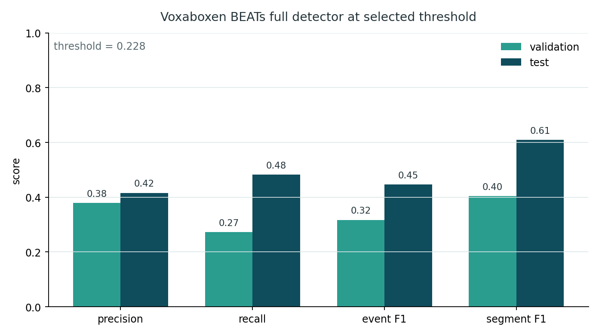
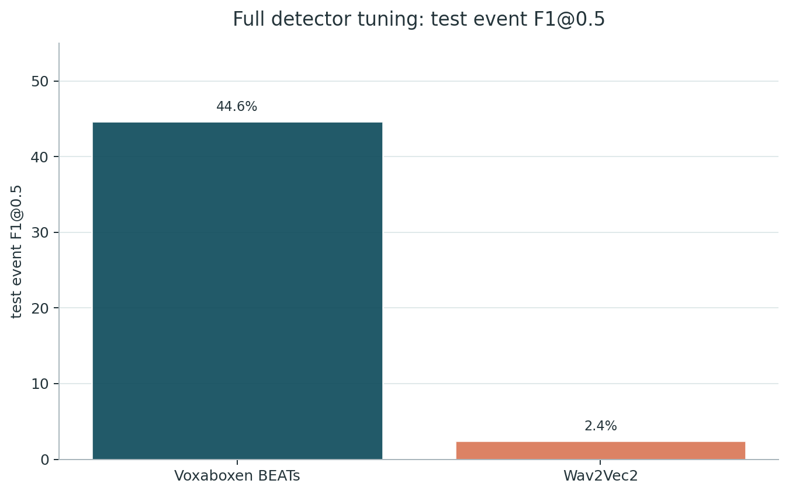
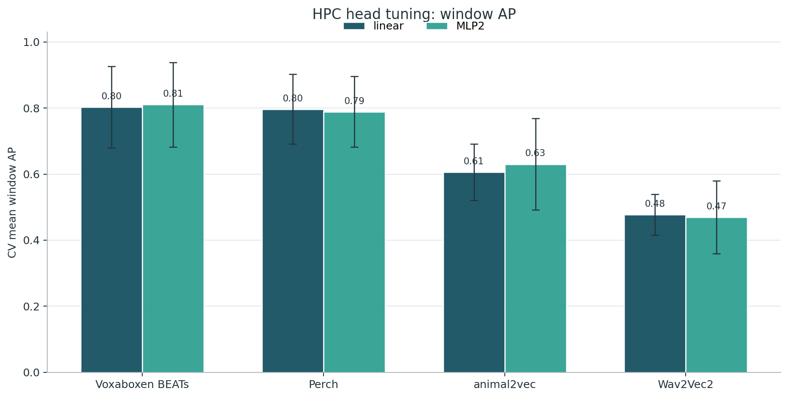
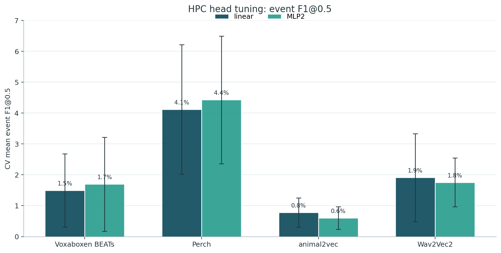
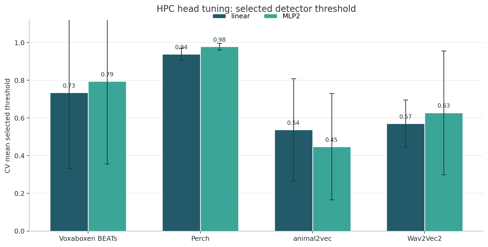
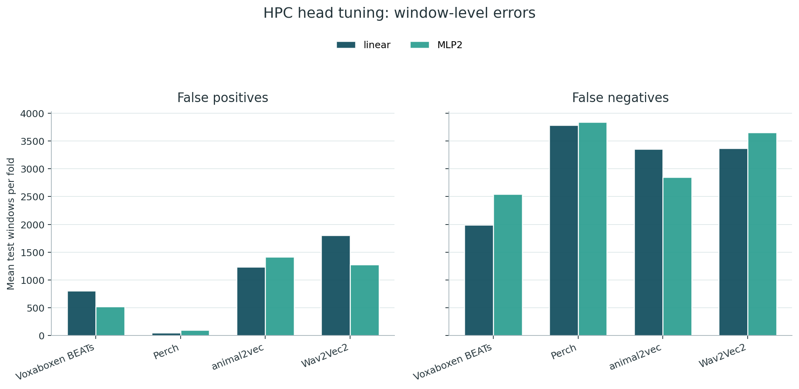
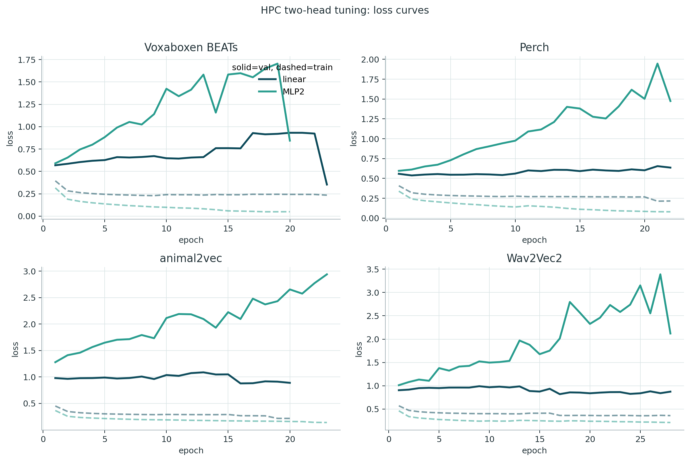
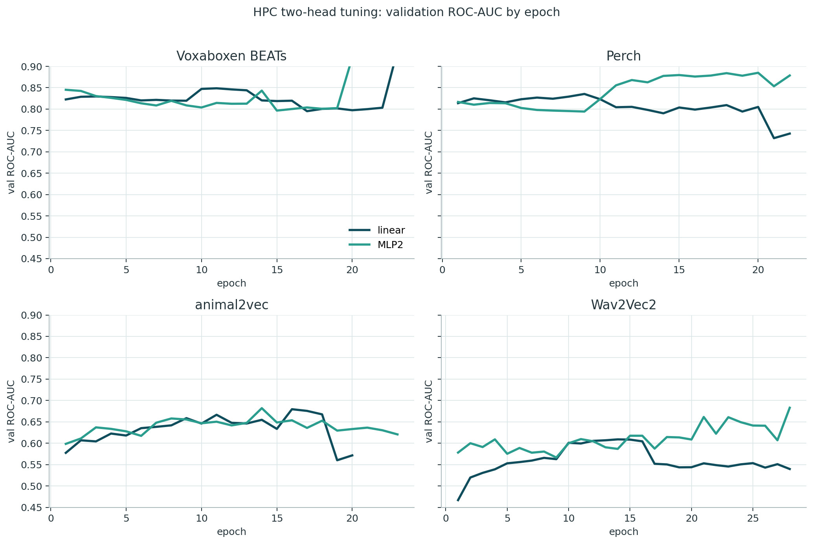

# HPC Tuning

The local frozen-embedding benchmark stays in `BENCHMARK.md`.

The goal was to check whether extra tuning improves detector-quality results. It did not: the runs can learn window ranking to some degree, but event-level detection remains weak except for the Voxaboxen full detector.

## Training Setup

All tuning runs used the same whale sound/noise labeling setup as the detector benchmark, but were run on HPC rather than locally. Windows were built from the prepared train/validation/test manifests, with sound windows coming from annotated whale-call intervals and noise windows sampled outside those intervals.

| Item | Setup |
|---|---|
| Data split | file-level split; train for fitting, validation for checkpoint/threshold selection, test for final reporting |
| Window task | binary sound/noise classification on fixed audio windows |
| Detector task | convert window scores into events, then score event overlap at IoU `0.5` |
| Threshold selection | selected on validation event F1@0.5, then fixed before test evaluation |
| Main test metric | event F1@0.5; segment/window metrics are secondary diagnostics |
| Full fine-tuning | model-specific detector training for Voxaboxen BEATs, Wav2Vec2, and attempted animal2vec |
| Two-head tuning | frozen benchmark embeddings with `linear` and `MLP2` classifier heads, evaluated with 5-fold file CV on `annotations_all` |

The important rule was that test data was not used to choose checkpoints or thresholds. Test scores below are therefore final held-out estimates for the selected validation setup.

## What Was Tried

| HPC experiment | Setup | Selection | Result |
|---|---|---|---|
| Full detector fine-tuning | Fine-tune model-specific detector setup where feasible | validation event F1@0.5 | Voxaboxen worked; Wav2Vec2 was weak; animal2vec was too slow/unstable |
| Two-head tuning | Frozen embeddings + `linear` and `MLP2` heads, 5-fold file CV | validation event F1@0.5 | Larger heads did not solve event detection |

The most likely explanation is data scale plus task mismatch: sound/noise windows are not enough to make clean event boundaries. The models can rank windows, but the thresholded event detector still produces weak event F1.

Thresholds were selected automatically on validation event F1@0.5. The high head-tuning thresholds are therefore not manual choices: they are the conservative cutoffs where validation F1 was least bad, mostly because lower thresholds create too many false-positive events.

## Full Fine-Tuning

This was the only tuning branch where a full detector became useful. Voxaboxen BEATs was the clear positive result: the selected validation threshold transferred to test better than the Wav2Vec2 detector, and animal2vec was too slow/unstable for a useful full run.

| Model | Run | Threshold | Test event F1@0.5 | Test precision@0.5 | Test recall@0.5 | Note |
|---|---:|---:|---:|---:|---:|---|
| Voxaboxen BEATs | full detector | 0.228 | 0.446 | 0.415 | 0.482 | useful |
| Wav2Vec2 | full fine-tune detector | 0.440 | 0.024 | 0.105 | 0.014 | weak |
| animal2vec | full fine-tune detector | n/a | n/a | n/a | n/a | too slow |

The Voxaboxen threshold selected on validation (`0.228`) gives better test behavior than validation: event F1 rises from `0.317` to `0.446`, and segment F1 rises from `0.404` to `0.609`. This is the strongest evidence that the Voxaboxen detector learned a usable event-level boundary, not just window ranking.

The comparison is intentionally simple: Voxaboxen BEATs is the only full fine-tune run with meaningful event F1. Wav2Vec2 finished, but its selected detector threshold produced almost no recall on test; animal2vec was not usable within the HPC budget.

## Two-Head CV

Mean over 5 file-level CV folds on `annotations_all`. These are HPC head-tuning runs only.

| Model | Head | Window AP | Window F1 | Event F1@0.5 | Event AP@0.5 | Selected threshold |
|---|---|---:|---:|---:|---:|---:|
| Voxaboxen BEATs | linear | 0.802 | 0.512 | 0.015 | 0.003 | 0.734 |
| Voxaboxen BEATs | MLP2 | 0.810 | 0.428 | 0.017 | 0.002 | 0.794 |
| Perch | linear | 0.797 | 0.337 | 0.041 | 0.006 | 0.938 |
| Perch | MLP2 | 0.789 | 0.323 | 0.044 | 0.007 | 0.978 |
| animal2vec | linear | 0.606 | 0.374 | 0.008 | 0.003 | 0.538 |
| animal2vec | MLP2 | 0.630 | 0.453 | 0.006 | 0.002 | 0.448 |
| Wav2Vec2 | linear | 0.477 | 0.303 | 0.019 | 0.003 | 0.570 |
| Wav2Vec2 | MLP2 | 0.469 | 0.280 | 0.018 | 0.003 | 0.628 |

Window AP says whether the frozen embeddings can rank sound windows above noise windows. Voxaboxen and Perch are strong here (`~0.79-0.81`), animal2vec is moderate (`~0.61-0.63`), and Wav2Vec2 is weak (`~0.47`). This explains why the heads can look reasonable at the window level while still failing as event detectors.

Event F1 is the main negative result. None of the two-head runs solve detection: even the best mean event F1 is only `0.044` for Perch MLP2. The heads improve neither event grouping nor boundary quality enough to compete with the full Voxaboxen detector.

The high thresholds are not manual tuning. They were selected by validation event F1@0.5 and show that the detector had to be conservative to avoid too many false-positive events. Perch, for example, selects thresholds near `0.94-0.98`, which is a sign of poor event calibration rather than a clean detector.

The error-count plot makes the failure mode more concrete. Perch and Wav2Vec2 heads avoid many false positives but miss many sound windows; Voxaboxen heads keep stronger ranking, but event-level F1 stays low after thresholding. So the issue is not only model capacity, it is also how window scores convert into events.

Loss curves are included only as a training sanity check. The heads did train, but lower loss did not translate into useful event F1, which is why these runs should be treated as failed detector tuning rather than failed optimization.

ROC-AUC confirms the same split between ranking and detection. Voxaboxen and Perch can separate windows better than Wav2Vec2, but high ROC-AUC alone is not enough for the event task because the final metric depends on thresholded event overlap.

The Wav2Vec2 full-training curve is not shown here because it mainly explains a failed run; the important full fine-tuning result is the Voxaboxen detector.
